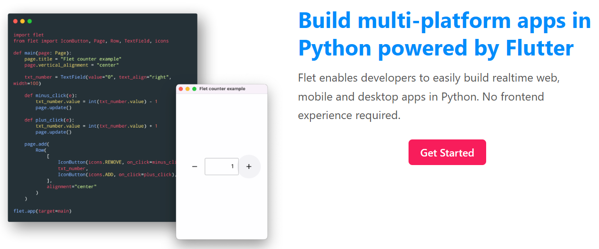
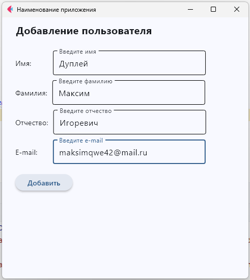
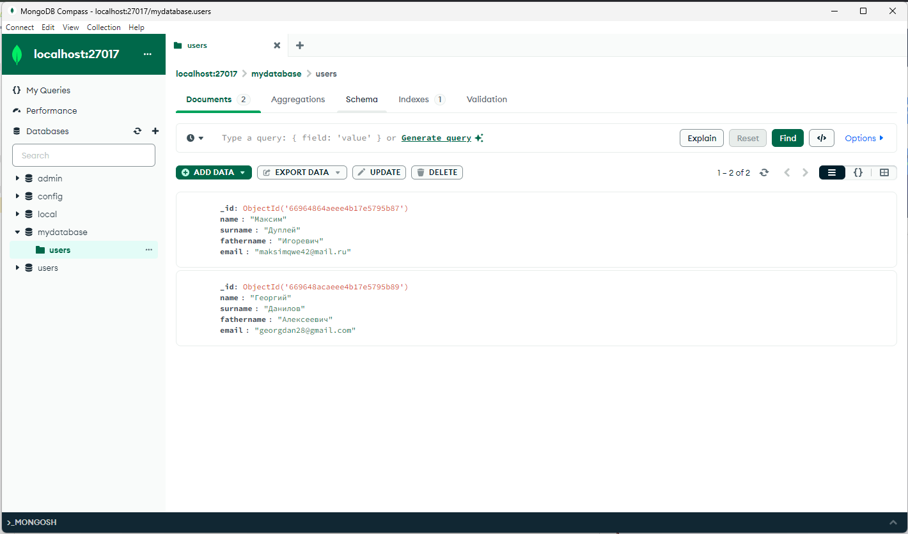

Flet позволяет разработчикам легко создавать веб-приложения, мобильные и настольные приложения в реальном времени на Python.

**MongoDB** — документоориентированная система управления базами данных, не требующая описания схемы таблиц.
Считается одним из классических примеров NoSQL-систем, использует JSON-подобные документы и схему базы данных.
Написана на языке C++.

**Дата:** 16/07/2024